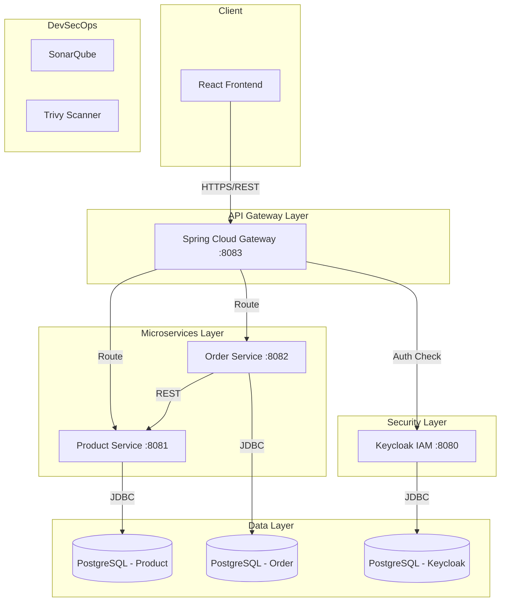
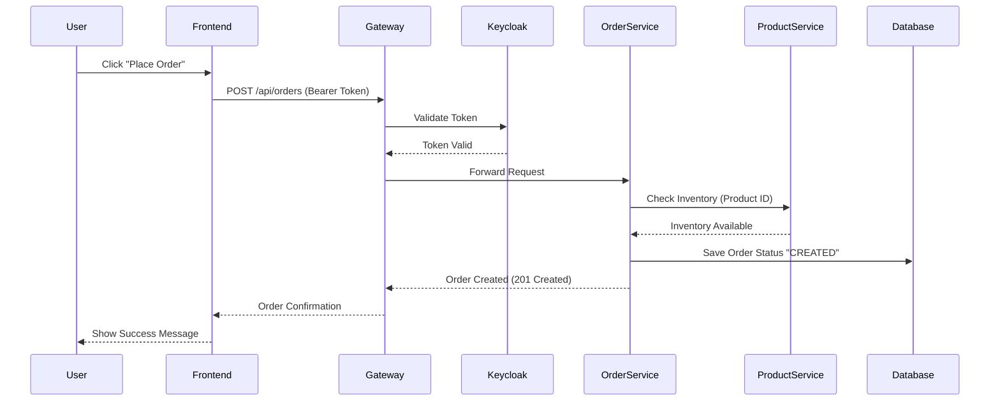

# Secure Microservices E-Commerce Application

A robust, secure e-commerce platform built with **Spring Boot Microservices**, **React**, **Keycloak** (OAuth2/OIDC), and a comprehensive **DevSecOps** pipeline offering static analysis (SonarQube) and container scanning (Trivy).

---

## 🏗️ Architecture

The application follows a microservices architecture pattern, orchestrating distinct services for specific business domains.



---

## 🚀 Key Features

*   **Microservices**: Decoupled Product and Order services.
*   **Security**: Centralized Identity & Access Management (IAM) with Keycloak.
*   **API Gateway**: Unified entry point for routing and load balancing.
*   **Frontend**: Modern React UI for customers and administrators.
*   **Observability**: Centralized logging and monitoring ready.
*   **DevSecOps**:
    *   **SAST**: SonarQube integration for code quality and security hotspots.
    *   **Container Security**: Trivy scanning for Docker image vulnerabilities.
    *   **SCA**: OWASP Dependency-Check for library vulnerabilities.

---

## 🛠️ Technology Stack

| Component | Technology |
| :--- | :--- |
| **Backend** | Java 21, Spring Boot 3.2, Spring Cloud Gateway |
| **Frontend** | React.js, Bootstrap / Tailwind |
| **Security** | Keycloak, OAuth2, OpenID Connect |
| **Database** | PostgreSQL 15 |
| **Containerization** | Docker, Docker Compose |
| **DevOps** | Maven, SonarQube, Trivy, OWASP Dependency-Check |

---

## 📋 Prerequisites

*   **Docker Desktop**: Installed and running.
*   **Java 21**: Installed (for local development).
*   **Node.js**: Installed (for frontend development).

---

## ⚙️ Installation & Setup

1.  **Clone the Repository**
    ```bash
    git clone https://github.com/your-username/secure-microservices-ecommerce.git
    cd secure-microservices-ecommerce
    ```

2.  **Build and Start Services**
    Use Docker Compose to bring up the entire stack (Databases, Keycloak, Backend, Frontend, SonarQube).
    ```bash
    docker-compose up -d --build
    ```

3.  **Access the Application**
    *   **Frontend**: [http://localhost:3000](http://localhost:3000)
    *   **Keycloak Admin**: [http://localhost:8080](http://localhost:8080) (user: `admin`, pass: `admin`)
    *   **SonarQube**: [http://localhost:9000](http://localhost:9000) (user: `admin`, pass: `admin`)

---

## 🖥️ User Interface

### Client View: Products
Customers can browse products and add them to their cart.


### Admin View: Orders
Administrators can view and manage customer orders.


### Order Process Flow (Sequence Diagram)
How an order is placed and processed through the system:



---

## 🛡️ DevSecOps & Security Scanning

We implement a **Shift-Left** security strategy integration testing tools directly into the development workflow.

### 1. Static Analysis (SonarQube)
Code quality and security hotspots analysis.

**Run Analysis:**
```powershell
.\scan_all.ps1
```

**Dashboard:**


### 2. Container Security (Trivy)
Scans Docker images for OS and library vulnerabilities.

**Run Scan:**
```powershell
.\scan_trivy.ps1
```

**Results Interface:**


### 3. Dependency Scanning (OWASP)
detects publicly disclosed vulnerabilities contained within project dependencies.

**Run Scan:**
```powershell
.\scan_dependency_check.ps1
```

---

## 📄 API Documentation

*   **Product Service**: `http://localhost:8081/swagger-ui.html`
*   **Order Service**: `http://localhost:8082/swagger-ui.html`